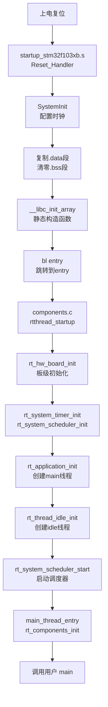

import { Aside } from 'astro-pure/user'

<Aside type='note' title='信息'>
  可参考集成项目：[stm32-nano](https://github.com/zephyraluco/stm32-nano)
</Aside>

## 环境搭建(MacOS)

使用 Homebrew 安装依赖:
```bash
brew install open-ocd
brew install --cask gcc-arm-embedded
```

## 环境搭建(Windows)

### OpenOCD

https://gnutoolchains.com/arm-eabi/openocd

### GCC

https://gitlab.arm.com/tooling/gnu-toolchains-for-arm

### ST-Link

https://www.st.com/en/development-tools/st-link-v2.html

也可直接下载：[stsw-link009.zip](/assets/stsw-link009.zip)

### VSCode 插件

必选插件：

1. [Cortex-Debug](https://marketplace.visualstudio.com/items?itemName=marus25.cortex-debug)
2. [C/C++](https://marketplace.visualstudio.com/items?itemName=ms-vscode.cpptools)
3. [CMake Tools](https://marketplace.visualstudio.com/items?itemName=ms-vscode.cmake-tools)
4. [CMake IntelliSense](https://marketplace.visualstudio.com/items?itemName=KylinIdeTeam.cmake-intellisence)
5. [Clangd](https://marketplace.visualstudio.com/items?itemName=llvm-vs-code-extensions.vscode-clangd)

## 程序启动流程

