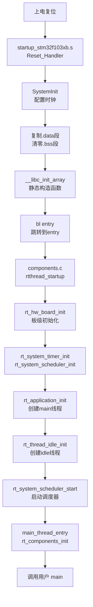

import { Aside } from 'astro-pure/user'

<Aside type='note' title='信息'>
  stm32+rtthread集成项目：[stm32-nano](https://github.com/zephyraluco/stm32-nano)
</Aside>

## 环境搭建(MacOS)

使用 Homebrew 安装依赖:
```bash
brew install open-ocd
brew install --cask gcc-arm-embedded
```

## 环境搭建(Windows)

### OpenOCD

https://gnutoolchains.com/arm-eabi/openocd

### GCC

https://gitlab.arm.com/tooling/gnu-toolchains-for-arm

### ST-Link

https://www.st.com/en/development-tools/st-link-v2.html

也可直接下载：[stsw-link009.zip](/assets/stsw-link009.zip)

### VSCode 插件

必选插件：

1. [Cortex-Debug](https://marketplace.visualstudio.com/items?itemName=marus25.cortex-debug)
2. [C/C++](https://marketplace.visualstudio.com/items?itemName=ms-vscode.cpptools)
3. [CMake Tools](https://marketplace.visualstudio.com/items?itemName=ms-vscode.cmake-tools)
4. [CMake IntelliSense](https://marketplace.visualstudio.com/items?itemName=KylinIdeTeam.cmake-intellisence)
5. [Clangd](https://marketplace.visualstudio.com/items?itemName=llvm-vs-code-extensions.vscode-clangd)

## RT-Thread 参考手册
https://www.rt-thread.org/document/api

## 程序启动流程



## 项目烧录
将OpenOCD安装路径下的 share/openocd/scripts/target 中对应芯片的配置文件和 share/openocd/scripts/interface 中对应的调试器配置文件拷贝到项目中，然后执行：
```shell
openocd -f stlink.cfg -f stm32f1x.cfg -c "program build/Debug/stm32-nano.elf verify reset exit"
```

命令参数说明：

- `openocd`：启动 Open On-Chip Debugger，一个开源的片上调试工具，通过调试器连接 PC 与目标芯片，完成烧录、调试等操作
- `-f stlink.cfg`：加载调试器（适配器）配置文件，指定使用 ST-Link 作为硬件调试器，配置其传输接口（USB）和信号协议
- `-f stm32f1x.cfg`：加载目标芯片配置文件，指定目标 MCU 为 STM32F1 系列，包含芯片的内核架构、Flash 容量、SWD/JTAG 接口等信息
- `-c "program ..."`：加载配置后执行引号内的命令
  - `program build/Debug/stm32-nano.elf`：将编译生成的 ELF 文件烧录到芯片的 Flash 中（OpenOCD 会自动调用 flash write 系列命令完成擦除和写入）
  - `verify`：烧录完成后校验 Flash 内容与 ELF 文件一致
  - `reset`：校验通过后复位芯片，使其重新启动运行新程序
  - `exit`：全部完成后退出 OpenOCD（不加则会保持连接，进入调试等待状态）