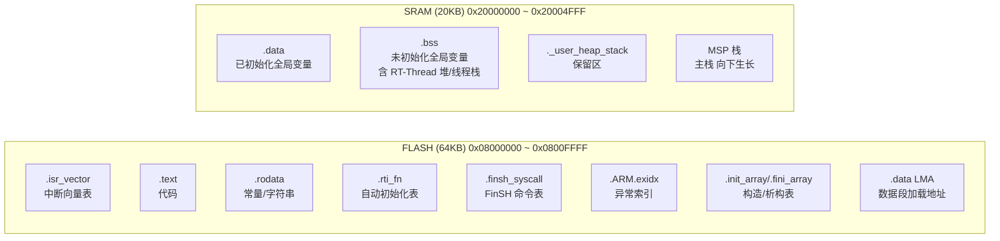
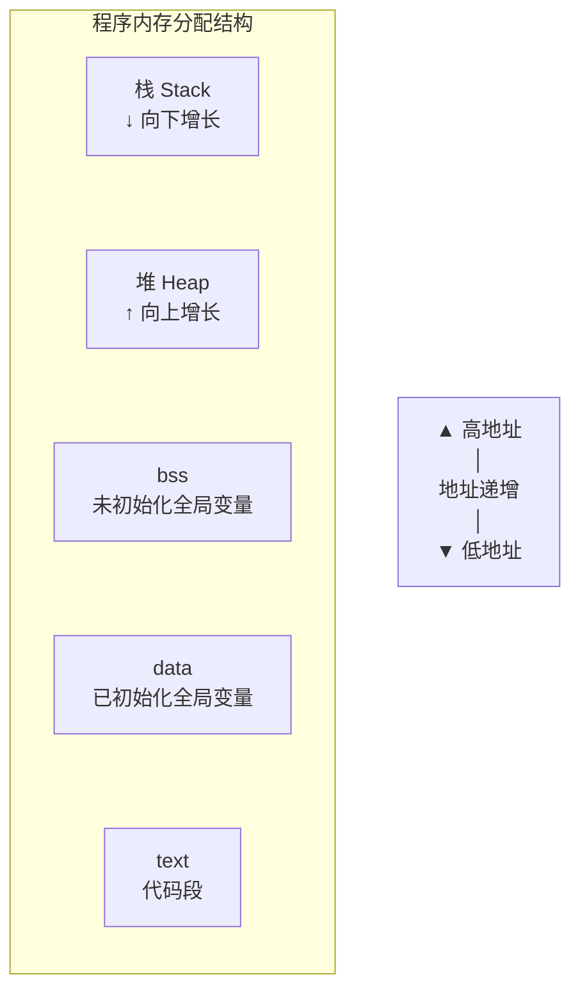

## 物理内存映射

以 **STM32F103C8T6** 为例，其拥有 **64KB FLASH** 和 **20KB SRAM**：

## 内存分配结构图

下图展示程序在地址空间中的分配情况（从上到下地址递减，高地址在上）：

| 段 | 所在存储器 | 内容 | 初始化方式 |
|----|-----------|------|-----------|
| `text` | FLASH | 程序指令（`.text`）与只读常量（`.rodata`） | 出厂即固化，无需初始化 |
| `data` | FLASH（LMA）→ SRAM（VMA） | 已初始化全局/静态变量 | 启动时由 `Reset_Handler` 从 FLASH 拷贝到 SRAM |
| `bss` | SRAM | 未初始化全局/静态变量 | 启动时由启动代码清零 |
| 堆 | SRAM | `malloc` / RT-Thread 动态内存 | 运行时向上增长，堆顶地址 `_end` 起 |
| 栈 | SRAM | 函数调用帧、局部变量 | 向下增长，Cortex-M 复位后指向 `_estack`（SRAM 顶端） |
