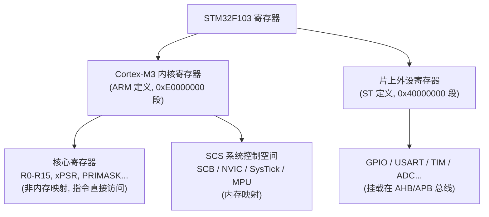

## Cortex-M3 核心寄存器

### 1. 通用寄存器(R0–R15)

| 寄存器 | 别名 | 作用 |
|--------|------|------|
| R0–R12 | 通用 | R0–R7 是低寄存器（Thumb 指令可访问），R8–R12 是高寄存器（部分指令可访问） |
| R13 | SP（MSP/PSP） | 堆栈指针，复位后用 MSP（主栈），RTOS 切任务时用 PSP（进程栈） |
| R14 | LR | 链接寄存器，保存函数返回地址 |
| R15 | PC | 程序计数器 |

### 2. 程序状态寄存器(xPSR)

```
APSR   N Z C V Q          （应用状态：负/零/进位/溢出/饱和）
EPSR   T                  （执行状态：Thumb 位，Cortex-M 恒为 1）
IPSR   异常号             （当前处于哪个异常/中断中）
```

`cmp`/`bcc` 用的就是 APSR 里的 N/Z/C/V 标志

### 3. 控制寄存器（特权级相关）

| 寄存器 | 作用 |
|--------|------|
| CONTROL | bit0=SPSEL（0=MSP, 1=PSP）；bit1=nPRIV（0=特权, 1=非特权） |
| PRIMASK | =1 时屏蔽除 NMI/HardFault 外的所有可屏蔽中断 |
| FAULTMASK | =1 时屏蔽除 NMI 外所有中断（含 HardFault） |
| BASEPRI | 屏蔽优先级数值 ≥ 该值的中断 |

RT-Thread 任务切换、临界区 `rt_enter_critical()` 常用 PRIMASK/BASEPRI

---

## 系统控制空间(SCS)

SCS（System Control Space）是 Cortex-M 内核的一部分，包含了一系列用于系统控制的寄存器，如 SCB（System Control Block）、NVIC（Nested Vectored Interrupt Controller）、SysTick 和 MPU（Memory Protection Unit），这些寄存器通过**内存映射**的方式进行访问

### 1. 系统控制块(SCB 0xE000ED00 段)

SCB 负责管理 Cortex-M 内核自身的系统控制、异常处理、复位、状态配置以及故障诊断

| 偏移 | 寄存器 | 作用 |
|------|--------|------|
| 0x04 | CTRL | 配置向量表、低功耗、复位等 |
| 0x08 | VTOR | **向量表偏移寄存器**，决定中断向量表基地址（默认 0x08000000） |
| 0x0C | AIRCR | 中断复位控制、优先级分组 |
| 0x10 | SCR | 睡眠控制（SEVONPEND/SLEEPDEEP） |
| 0x14 | CCR | STKALIGN/BFHFNMIGN 等 |
| 0x18–0x23 | SHPR1–3 | 异常优先级（MemManage/BusFault/UsageFault/SVC 等） |
| 0x28 | SHCSR | 系统异常使能（MemFault/BusFault/USGFAULTACT） |
| 0x2C–0x37 | CFSR/HFSR/MMFSR/BFSR/UFSR | 各种 fault 状态 |
| 0x3C | HFSR | HardFault 状态 |
| 0x40 | DFSR | 调试 fault 状态 |

### 2. 嵌套向量中断控制器(NVIC 0xE000E100 段)

NVIC 管理 Cortex-M 的可屏蔽中断，支持**可嵌套**（高优先级抢占低优先级）、**向量化**（中断直接跳转到向量表对应入口）和**尾链**（Tail-chaining，连续中断无额外进出栈开销）

| 偏移 | 寄存器 | 作用 |
|------|--------|------|
| 0x000 | ISER | 中断**使能**（Set-Enable），每 bit 对应一个 IRQn，写 1 使能 |
| 0x080 | ICER | 中断**禁止**（Clear-Enable），写 1 禁止 |
| 0x100 | ISPR | 置**挂起**（Set-Pending），软件置挂起位 |
| 0x180 | ICPR | 清**挂起**（Clear-Pending） |
| 0x200 | IABR | **活动**状态查询（Active Bit，只读） |
| 0x300 | IPR | 中断**优先级**（每个 IRQn 占 1 字节，M3 只实现高 4 位） |
| 0xF00 | STIR | 软件触发中断（Software Trigger Interrupt，仅特权模式） |

### 3. 系统节拍定时器(SysTick 0xE000E010 段)

SysTick 是内核自带的 24 位**递减计数器**，常作为 RTOS 系统时钟源

| 偏移 | 寄存器 | 作用 |
|------|--------|------|
| 0x00 | CTRL | 控制/状态：ENABLE（bit0）、TICKINT（bit1，计数到 0 触发异常）、CLKSOURCE（bit2，时钟源）、COUNTFLAG（bit16，计数到 0 置位） |
| 0x04 | LOAD | 重装载值（低 24 位），计数到 0 后自动重装 |
| 0x08 | VAL | 当前计数值；读返回剩余值，写任意值清零并清 COUNTFLAG |
| 0x0C | CALIB | 校准值（由厂商提供，一般可忽略） |

### 4. 内存保护单元(MPU 0xE000ED90 段)

MPU 把内存划分为若干**区域**，定义每块区域的访问权限（特权/非特权、读写、是否可执行）

| 偏移 | 寄存器 | 作用 |
|------|--------|------|
| 0x00 | TYPE | 类型：支持的区域数、是否支持统一指令/数据区（只读） |
| 0x04 | CTRL | 控制：ENABLE（bit0）、HFNMIENA（bit1，NMI/HardFault 下仍生效）、PRIVDEFENA（bit2，默认特权区） |
| 0x08 | RNR | 当前选中的区域号（0–7） |
| 0x0C | RBAR | 区域基地址（需按区域大小对齐） |
| 0x10 | RASR | 区域属性：ENABLE/SIZE/AP（访问权限）/XN（禁止执行）等 |
| 0x14–0x2C | RBAR/RASR 别名 | 对 RNR 指向区域快速编程，无需重写 RNR |
